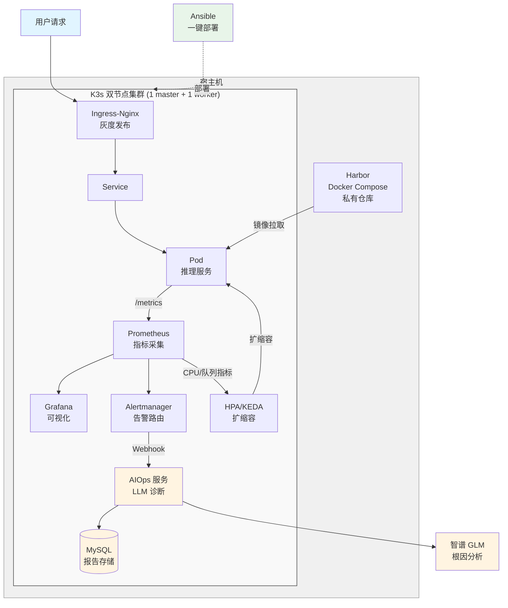

# K3s AI 推理平台

基于 K3s 的云原生 AI 推理平台，集成 Harbor、Prometheus、Ingress-Nginx、HPA/KEDA、RBAC/NetworkPolicy、AIOps 智能诊断、MySQL 持久化，通过 Ansible 实现一键部署，GitHub Actions 实现 CI/CD。

## 项目背景

学习性质的云原生 AI 推理平台部署实践。模拟 AI 公司推理服务的运维场景：镜像管理、监控告警、灰度发布、自动扩缩容、安全加固、智能诊断。
**不是真实生产环境**，双节点部署（1 master + 1 worker），无真实流量。但尽量模拟了生产中的关键问题，记录了 20 个真实排错案例。

## 已实现

- K3s 双节点集群搭建，配置镜像加速和私有仓库
- Harbor 私有镜像仓库，镜像推送与拉取
- Prometheus + Grafana 监控集群和应用指标
- Ingress-Nginx Canary 灰度发布，支持切流回滚
- HPA + KEDA 自动扩缩容（CPU / 队列长度）
- RBAC + NetworkPolicy 安全加固
- AIOps 智能诊断：告警自动触发 LLM 分析并输出根因，诊断报告持久化到 MySQL，提供 API 查询历史记录
- Ansible 多机一键部署
- GitHub Actions CI/CD：代码提交自动构建镜像并推送到 ghcr.io

## 待实现

- GPU 调度和显存监控
- GPU 成本优化（缩容到 0、模型量化）

## 架构



## 技术栈

K3s、Docker、Harbor、Prometheus、Grafana、Alertmanager、Ingress-Nginx、HPA、KEDA、RBAC、NetworkPolicy、Ansible、Python、Shell、MySQL、GitHub Actions

## 项目结构

```
.
├── .github/
│   └── workflows/
│       └── build-aiops.yml
├── ansible/
│   ├── inventory/
│   │   └── hosts
│   └── playbooks/
│       └── site.yml
├── scripts/
├── projects/
│   ├── aiops-agent/
│   │   ├── app.py
│   │   ├── mysql.yaml
│   │   ├── deploy.yaml
│   │   ├── Dockerfile
│   │   └── requirements.txt
│   ├── grayscale/
│   └── hpa-test/
└── docs/
    └── troubleshooting.md
```

## 快速开始

### 环境要求

- Ubuntu 22.04 / 24.04，2 台服务器（1 master + 1 worker）
- 每台 4核8G 以上，Docker 预装可选
- 本地已配置 GitHub SSH 密钥

### 部署步骤

```
# 1. 克隆仓库
git clone git@github.com:y3260602916/k3s-ai-platform.git
cd k3s-ai-platform

# 2. 配置 API Key（用于 AIOps）
bash scripts/setup-env.sh

# 3. 修改集群配置
vi ansible/group_vars/all.yml       # 改 master/worker 内网 IP
vi ansible/inventory/hosts          # 改 worker 内网 IP

# 4. 配置 SSH 免密（master → worker）
ssh-keygen -t ed25519 -N "" -f ~/.ssh/id_ed25519
ssh-copy-id root@<worker内网IP>

# 5. 一键部署
cd ansible
ansible-playbook -i inventory/hosts playbooks/site.yml
```
### 部署完成后包含

**基础组件：**
- K3s 双节点集群（1 master + 1 worker）
- Harbor 私有镜像仓库
- Prometheus + Grafana + Alertmanager 监控
- Ingress-Nginx
- KEDA 组件

**业务应用：**
- MySQL + 自动建表
- AIOps 智能诊断服务
- hpa-demo 测试服务
- Prometheus 自定义告警规则
- 灰度发布示例（v1/v2 + Canary Ingress）
- ServiceMonitor + KEDA ScaledObject

### 验证部署
```
kubectl get nodes
kubectl get pods -A
curl http://127.0.0.1:8081/api/v2.0/health    # Harbor
```
访问 Grafana
1. 获取 admin 密码
```
kubectl get secret -n monitoring monitoring-grafana -o jsonpath="{.data.admin-password}" | base64 -d
echo
```
2. 本地建立 SSH 隧道
```
ssh -L 3000:localhost:3000 root@<master公网IP>
```
3. master 上执行 port-forward
```
kubectl port-forward -n monitoring svc/monitoring-grafana 3000:80
```
4. 浏览器访问 http://localhost:3000，用户名 admin，密码用第 1 步获取的。

## AIOps 智能诊断

告警触发 → Alertmanager Webhook → AIOps 服务 → 拉取 Pod 日志 → 调用 GLM 分析根因 → 输出排查建议 → 存储到 MySQL。

**实测数据：** 14 次模拟告警中 13 次成功返回诊断结果，1 次因超时降级，成功诊断平均耗时约 20 秒。

## CI/CD

代码 push 到 main 分支时，GitHub Actions 自动：

1. 构建 AIOps 服务镜像

2. 推送到 [ghcr.io](https://ghcr.io/)

Workflow 文件：`.github/workflows/build-aiops.yml`

## 排错记录

开发过程中遇到 20 个真实故障，涵盖镜像拉取、端口冲突、容器网络、版本不匹配、AIOps 部署等。详见 [docs/troubleshooting.md](docs/troubleshooting.md)。

## 项目截图

### AIOps 智能诊断日志

告警触发后自动采集 Pod 日志，调用 GLM 分析根因，诊断结果持久化到 MySQL。


### MySQL 诊断报告持久化

14 条诊断记录，包含 LLM 耗时、总耗时、创建时间。


### Grafana 集群监控

集群 CPU、内存利用率，各命名空间资源占比。


### 双节点集群运行状态

1 master（control-plane）+ 1 worker，K3s 集群正常，所有组件运行正常。


### GitHub Actions CI/CD

代码提交自动构建镜像并推送到 ghcr.io，所有步骤通过。


