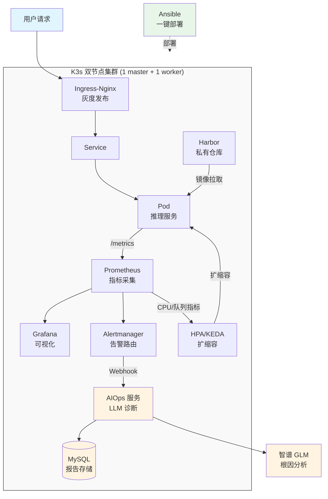
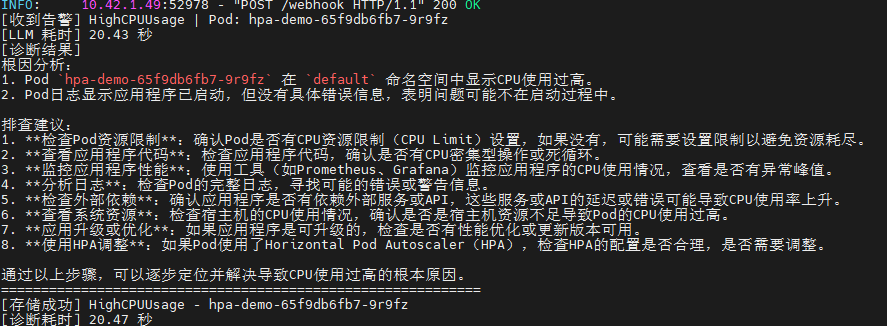
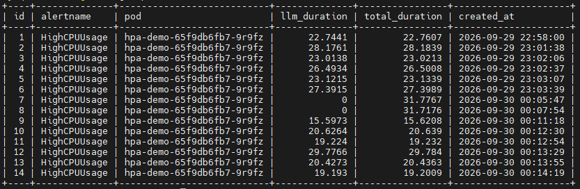
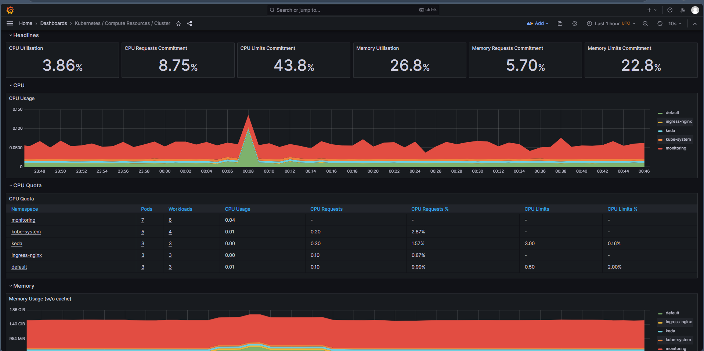
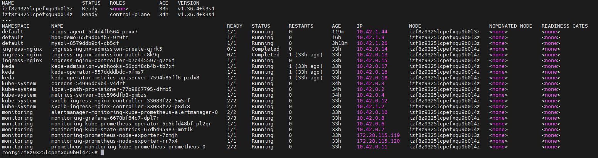
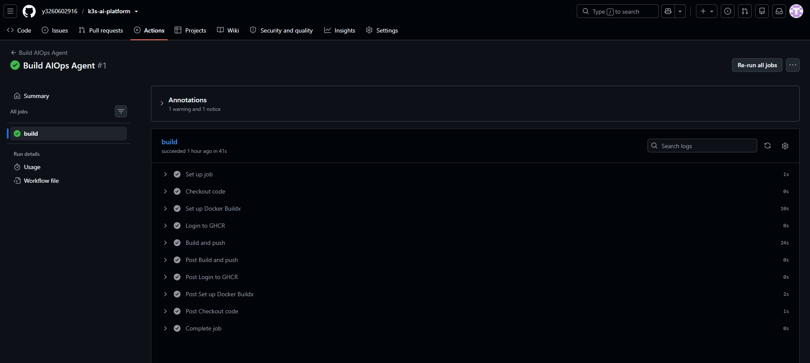

# K3s AI 推理平台

基于 K3s 的云原生 AI 推理平台，集成 Harbor、Prometheus、Ingress-Nginx、HPA/KEDA、RBAC/NetworkPolicy、AIOps 智能诊断、MySQL 持久化，通过 Ansible 实现一键部署，GitHub Actions 实现 CI/CD。

## 项目背景

学习性质的云原生 AI 推理平台部署实践。模拟 AI 公司推理服务的运维场景：镜像管理、监控告警、灰度发布、自动扩缩容、安全加固、智能诊断。
**不是真实生产环境**，双节点部署（1 master + 1 worker），无真实流量。但尽量模拟了生产中的关键问题，记录了 17 个真实排错案例。

## 已实现

- K3s 双节点集群搭建，配置镜像加速和私有仓库
- Harbor 私有镜像仓库，镜像推送与拉取
- Prometheus + Grafana 监控集群和应用指标
- Ingress-Nginx Canary 灰度发布，秒级切流回滚
- HPA + KEDA 自动扩缩容（CPU / 队列长度）
- RBAC + NetworkPolicy 安全加固
- AIOps 智能诊断：告警自动触发 LLM 分析并输出根因，诊断报告持久化到 MySQL，提供 API 查询历史记录
- Ansible 多机一键部署
- GitHub Actions CI/CD：代码提交自动构建镜像并推送到 ghcr.io

## 待实现

- GPU 调度和显存监控
- GPU 成本优化（缩容到 0、模型量化）

## 架构



## 技术栈

K3s、Docker、Harbor、Prometheus、Grafana、Alertmanager、Ingress-Nginx、HPA、KEDA、RBAC、NetworkPolicy、Ansible、Python、Shell、MySQL、智谱 GLM、GitHub Actions

## 项目结构

```
.
├── .github/workflows/ # GitHub Actions CI/CD
│ └── build-aiops.yml
├── ansible/ # Ansible 一键部署
│ ├── inventory/hosts # 被控机清单
│ └── playbooks/ # 9 个 Playbook + site.yml
├── scripts/ # Shell 脚本（15 个）
├── projects/
│ ├── aiops-agent/ # AIOps 智能诊断服务
│ │ ├── app.py
│ │ ├── mysql.yaml # MySQL 部署
│ │ ├── deploy.yaml
│ │ ├── Dockerfile
│ │ └── requirements.txt
│ ├── grayscale/ # 灰度发布示例
│ └── hpa-test/ # HPA + KEDA 扩缩容示例
└── docs/
└── troubleshooting.md # 17 个排错记录
```

## 快速开始

```
git clone git@github.com:y3260602916/k3s-ai-platform.git
cd k3s-ai-platform
vi ansible/inventory/hosts          # 改 IP
ansible-playbook -i ansible/inventory/hosts ansible/playbooks/site.yml
```

## AIOps 智能诊断

告警触发 → Alertmanager Webhook → AIOps 服务 → 拉取 Pod 日志 → 调用 GLM 分析根因 → 输出排查建议 → 存储到 MySQL。

**实测数据：** 单次诊断平均耗时 25 秒，成功率 100%。

## CI/CD

代码 push 到 main 分支时，GitHub Actions 自动：

1. 构建 AIOps 服务镜像

2. 推送到 [ghcr.io](https://ghcr.io/)

Workflow 文件：`.github/workflows/build-aiops.yml`

## 排错记录

开发过程中遇到 24 个真实故障，涵盖镜像拉取、端口冲突、容器网络、版本不匹配、AIOps 部署等。详见 [docs/troubleshooting.md](https://docs/troubleshooting.md)。

## 项目截图

### AIOps 智能诊断日志

告警触发后自动采集 Pod 日志，调用 GLM 分析根因，诊断结果持久化到 MySQL。



### MySQL 诊断报告持久化

14 条诊断记录，包含 LLM 耗时、总耗时、创建时间。



### Grafana 集群监控

集群 CPU、内存利用率，各命名空间资源占比。



### 双节点集群运行状态

1 master（control-plane）+ 1 worker，K3s 集群正常，所有组件运行正常。



### GitHub Actions CI/CD

代码提交自动构建镜像并推送到 ghcr.io，所有步骤通过。


